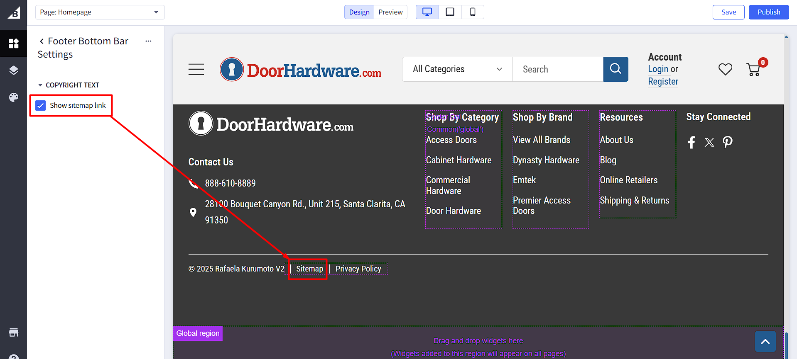

# Footer

## Contact Us

It contains the phone numbur and address.

We used the built-in BigCommerce settings for this.

To edit it, go to the store profile settings in BigCommerce.

For more information, see the <a href="https://support.bigcommerce.com/s/article/Store-Profile-Settings?language=en_US#contact-info" target="_blank">BigCommerce documentation</a>.

## Navigation Items

1. This section is made using a custom widget called `Footer Col Common`. You can change the content in the [Page Builder](index.md/#page-builder).

2. You can change the content by clicking on it and changing the settings on the left panel. You can change the item name and item url.

3. Use the plus `+` icon to add new items, and the `< and >` arrow icons to navigate and adjust individual item settings as needed.

4. By clicking on the ellipsis on the top right corner of the left panel, you can change the section settings, like update the column header text.

5. Click on the `Save` (to preview the changes) Or `Publish` (to make them live) button.

## Bottom Bar

1. This section is made using a custom widget called `Footer Bottom Bar`. You can change the content in the [Page Builder](index.md/#page-builder).

2. You can change the content by clicking on it and changing the settings on the left panel. You can change the item name and item url.

3. Use the plus `+` icon to add new items, and the `< and >` arrow icons to navigate and adjust individual item settings as needed.

4. By clicking on the ellipsis on the top right corner of the left panel, you can change the section settings, like enable/disable sitemap link.

5. Click on the `Save` (to preview the changes) Or `Publish` (to make them live) button.

