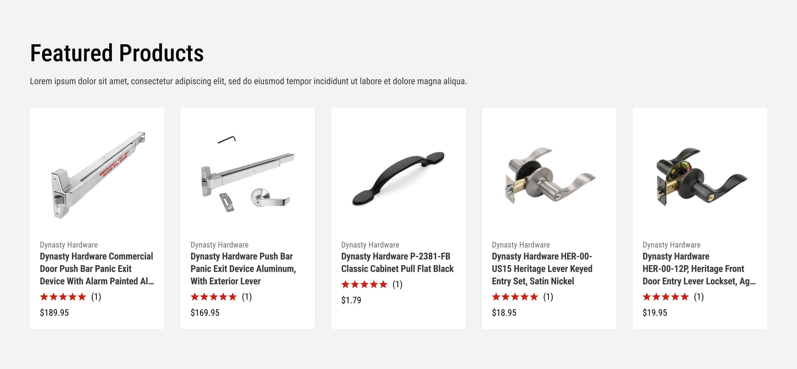
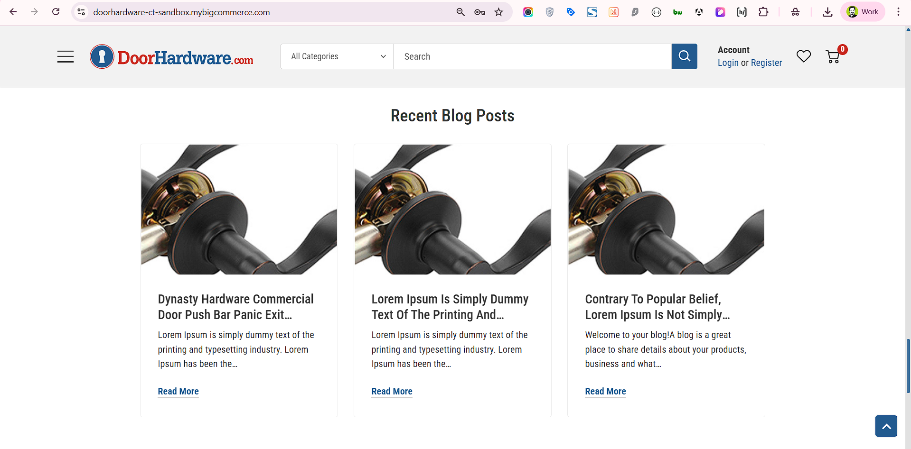
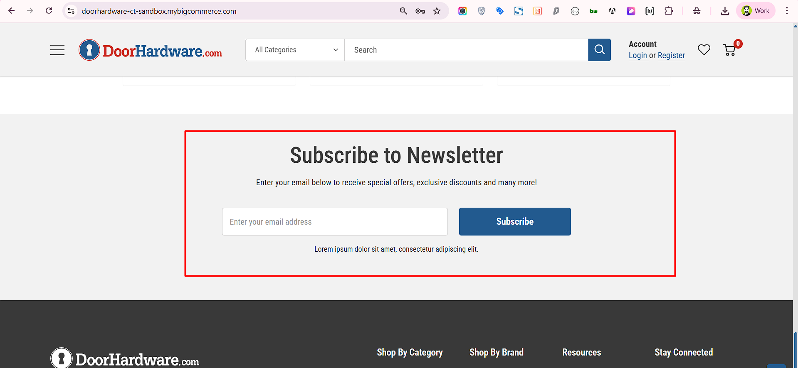
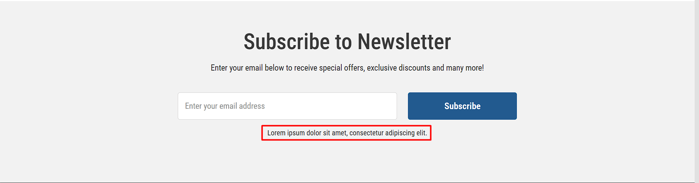
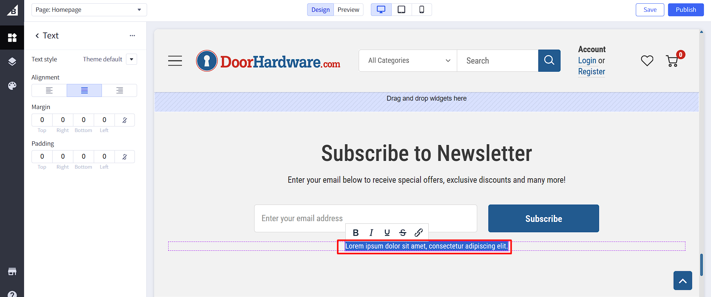

# Homepage
The homepage is the main page of the website. It is the first page that the user sees when they visit the website.

## Hero Banner

The Hero Banner Carousel is using the built-in BigCommerce Home Page Carousel.
Please follow the <a href="https://support.bigcommerce.com/s/article/Carousel?language=en_US" target="_blank">BigCommerce documentation</a> to see how to manage it.
Please note that the styles are in the theme and should not be changed unless you are confident in your abilities.

## Featured Products

The Featured Products panel displays products that you have marked as Featured.
To mark a product as Featured, simply go to the product listing via Products->View, then click on the star symbol on the product you want to display.

If your dashboard looks different, please follow the <a href="https://support.bigcommerce.com/s/article/Product-Panels?language=en_US#featured-products" target="_blank">BigCommerce documentation</a> to see how to manage it.

## Best Sellers

The Best Sellers panel displays the store's top-selling products dynamically. It cannot be manually configured. You can read more about it in the <a href="https://support.bigcommerce.com/s/article/Product-Panels?language=en_US#top-sellers" target="_blank">BigCommerce documentation</a>.

## Shop by Category

The Shop by Category section is made using a custom widget called Home Image Card. You can change the content in the [Page Builder](index.md/#page-builder).

You can change the text by clicking on it and changing the settings on the left panel. You can add more cards, change the image, and text for each one.

By clicking on the ellipsis on the top right corner of the left panel, you can change the section settings, like title, and style.

## Shop by Brand

The Shop by Brand section is made using the same custom widget called Home Image Card. You can follow the same steps above.

## About Us

The About Us section is made using a custom widget with an HTML block from the theme called Parralax Banner. You can ready more instructions and even generate a new code following the <a href="https://themes.halothemes.com/documents/bigcommerce-annie-garden/#setting_up_homepage_content:~:text=forget%20click%20Save.-,Block%3A%20Parralax%20Banner,-To%20show%20Parralax" target="_blank">theme's documentation</a>.

## Our Retailers

The Our Retailers section is made using a custom widget with an HTML block from the theme called `Block: Brand Collection`. You can ready more instructions and even generate a new code following the <a href="https://themes.halothemes.com/documents/bigcommerce-annie-garden/#home_banner_0_block" target="_blank">theme's documentation</a>.

## Recent Blog Posts

The Recent Blog sections developed by Halothemes. For further details and guidance, please review the <a href="https://themes.halothemes.com/documents/bigcommerce-annie-garden/#home_recent_posts" target="_blank">Halothemes documentation</a>.

## Newsletter Signup

1. The Newsletter sections developed by Halothemes. For further details and guidance, please review the <a href="https://themes.halothemes.com/documents/bigcommerce-annie-garden/#setting_subscription_form" target="_blank">Halothemes documentation</a>.

2. We used the built-in BigCommerce newsletter summary for sub text. For more information see the <a href="https://support.bigcommerce.com/s/article/Collecting-Newsletter-Subscriptions?language=en_US#newsletter" target="_blank">BigCommerce documentation</a>.

3. This section is made using a built-in widget called `Text`. You can change the content in the [Page Builder](index.md/#page-builder).

