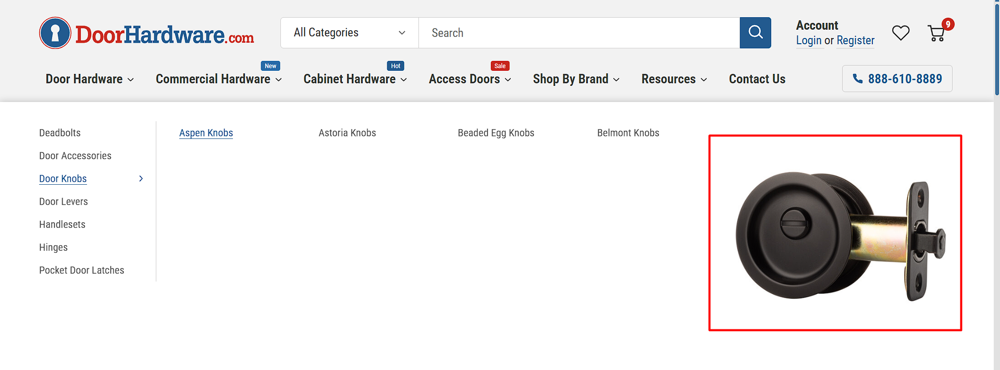

# Megamenu

We set up the mega menu to match the current live store. Category thumbnails are managed from the BigCommerce backend via the "Category Image" setting. You can update and manage category images directly in the BigCommerce backend. For more detailed information, please refer <a href="https://support.bigcommerce.com/s/article/Categories-and-Brands?language=en_US#category-details" target="_blank">BigCommerce documentation</a>. 