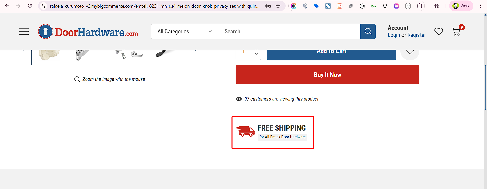

# Product Page
The product page displays the information about the product. It includes the product name, description, price, options, and an image of the product.

Most of the product page is built with the default BigCommerce settings, for more information regarding how to add a product in Bigcommerce with the V2 settings, refer to this <a href="https://support.bigcommerce.com/s/article/Adding-Products-v2?language=en_US" target="_blank">documentation</a>. 

There are some parts on the product page that need to follow specific guidelines.

## Product Tooltip

Product options tooltips are managed through product custom fields in BigCommerce. By adding or editing a product's custom field, you can display additional information as a tooltip on the product page. You can follow below step:

1. You can create/add new custom field using <a href="https://support.bigcommerce.com/s/article/Custom-Fields?language=en_US#add" target="_blank">this</a> article.

2. You can add custom field name and value per below:
    1. Custom Field Name: `tooltip|Your Product Options Name`
    2. Custom Field Value: `Add your tooltip text`
    3. Example :- Name: `tooltip|backset` and Value: `To Determine The Backset Needed Measure From The Edge Of Your Door To The Center Of The 2-1/8 Inch Diameter Hole In The Face Of Your Door`
    4. You can review below screenshot 
    

3. Click on the 'Save' button

## Free Shipping

1. This section is made using a custom widget called `Product Free Shipping`. You can change the content in the [Page Builder](index.md/#page-builder).

2. You can change the test by clicking on it and changing the settings on the left panel. You can change the Title and description.

3. Click on the `Save` (to preview the changes) Or `Publish` (to make them live) button.

## Related Products Sub Text

1. This section is made using a built-in widget called `Text`. You can change the content in the [Page Builder](index.md/#page-builder).

2. You can change the test by clicking on it and changing the settings on the left panel. You can change the Title and description.

3. Click on the `Save` (to preview the changes) Or `Publish` (to make them live) button.

## Product tabs

The product tabs are used to display additional information about the product. The tabs include the description, specifications, shipping info, and FAQ. 
The content comes from the product description, following a specific format, like the one already set in some of the current products.

The product tab sections developed by Halothemes. For further details and guidance, please review the <a href="https://themes.halothemes.com/documents/bigcommerce-annie-garden/#product_detail_tab" target="_blank">Halothemes documentation</a>.

## Related Items

The related items section displays products that are related to the current product. These are usually automatically picked by BigCommerce or can be set manually in the product settings.
Please refer to the BigCommerce <a href="https://support.bigcommerce.com/s/article/Adding-Products-v2?language=en_US#related" target="_blank">documentation</a> for more details.
