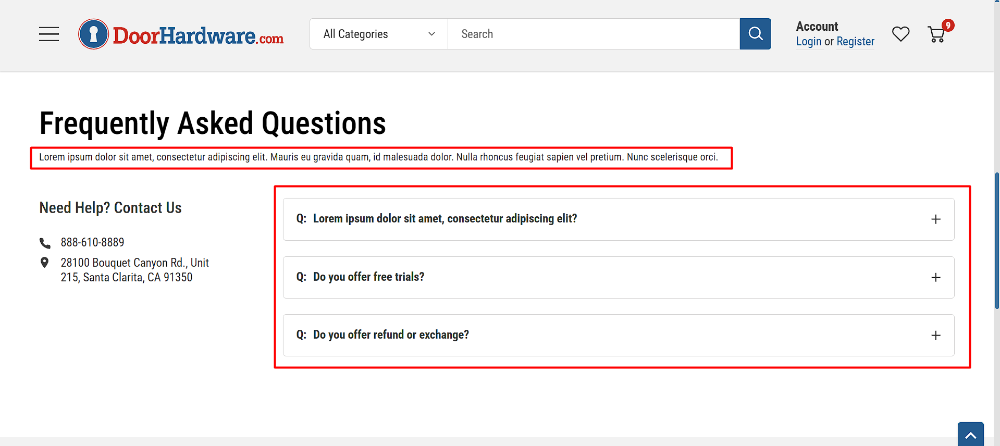

# Static Page (FAQ Page)

## Image with Content Section

1. This section is made using a custom widget called `Image with Content`. You can change the content in the [Page Builder](index.md/#page-builder).

2. You can change the settings by clicking on it and changing the settings on the left panel. You can change the Title, Description, Image Position, Image Alt Text text and button.

3. Click on the `Save` (to preview the changes) Or `Publish` (to make them live) button.

## Contact Section

It contains the phone numbur and address.

We used the built-in BigCommerce settings for this.

To edit it, go to the store profile settings in BigCommerce.

For more information, see the <a href="https://support.bigcommerce.com/s/article/Store-Profile-Settings?language=en_US#contact-info" target="_blank">BigCommerce documentation</a>.

## FAQs Section

The FAQ sections developed by Halothemes. For further details and guidance, please review the <a href="https://themes.halothemes.com/documents/bigcommerce-annie-garden/#faqs_page" target="_blank">Halothemes documentation</a>.