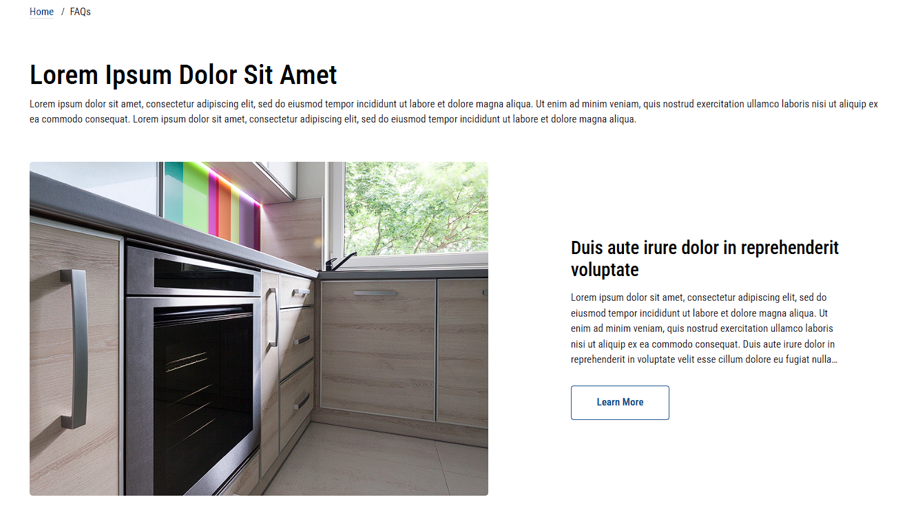

# Static Page

1. This section is made using a custom widget called `Page Hero Banner`. You can change the content in the [Page Builder](index.md/#page-builder).

2. You can change the text by clicking on it and changing the settings on the left panel. You can change the image, text and hide breadcrumb.

3. Click on the `Save` (to preview the changes) Or `Publish` (to make them live) button.
